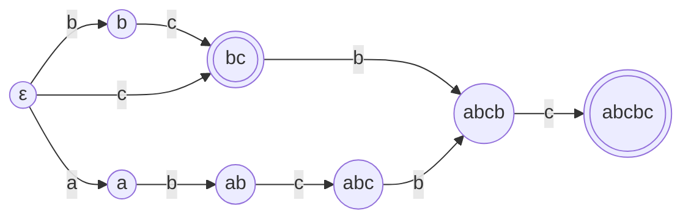

# general-sam-py

[](https://pypi.org/project/general-sam/)
[](#license)
[](https://github.com/ModelTC/general-sam-py/actions)

Python bindings for [`general-sam`](https://github.com/ModelTC/general-sam)
and some utilities.



> The suffix automaton of abcbc.

## Installation

```sh
pip install general-sam
```

## Usage

### `GeneralSAM`

```python
from general_sam import GeneralSAM

sam = GeneralSAM.from_bytes(b"abcbc")

# "cbc" is a suffix of "abcbc"
state = sam.get_root_state()
state.feed_bytes(b"cbc")
assert state.is_accepting()

# "bcb" is not a suffix of "abcbc"
state = sam.get_root_state()
state.feed_bytes(b"bcb")
assert not state.is_accepting()
```

```python
from general_sam import GeneralSAM

sam = GeneralSAM.from_chars("abcbc")
state = sam.get_root_state()

# "b" is not a suffix but at least a substring of "abcbc"
state.feed_chars("b")
assert not state.is_accepting()

# "bc" is a suffix of "abcbc"
state.feed_chars("c")
assert state.is_accepting()

# "bcbc" is a suffix of "abcbc"
state.feed_chars("bc")
assert state.is_accepting()

# "bcbcbc" is not a substring, much less a suffix of "abcbc"
state.feed_chars("bc")
assert not state.is_accepting() and state.is_nil()
```

```python
from general_sam import GeneralSAM, GeneralSAMState, build_trie_from_chars

trie, _ = build_trie_from_chars(["hello", "Chielo"])
sam = GeneralSAM.from_trie(trie)


def fetch_state(s: str) -> GeneralSAMState:
    state = sam.get_root_state()
    state.feed_chars(s)
    return state


assert fetch_state("lo").is_accepting()
assert fetch_state("ello").is_accepting()
assert fetch_state("elo").is_accepting()

state = fetch_state("el")
assert not state.is_accepting() and not state.is_nil()

state = fetch_state("bye")
assert not state.is_accepting() and state.is_nil()
```

### `VocabPrefixAutomaton`

```python
from general_sam import CountInfo, VocabPrefixAutomaton

vocab = ["歌曲", "聆听歌曲", "播放歌曲", "歌词", "查看歌词"]
automaton = VocabPrefixAutomaton(vocab, bytes_or_chars="chars")

# NOTE: CountInfo instances are actually related to the sorted `vocab`:
_ = ["播放歌曲", "查看歌词", "歌曲", "歌词", "聆听歌曲"]

# Case 1:
#   一起 | 聆 | 听 | 歌
state = automaton.get_root_state()

# prepend '歌'
cnt_info = automaton.prepend_feed(state, "歌")
assert cnt_info is not None and cnt_info == CountInfo(
    str_cnt=2, tot_cnt_lower=2, tot_cnt_upper=4
)

# found '歌曲' at the index 0 and '歌词' at the index 3 prefixed with '歌'
selected_idx = automaton.get_order_slice(cnt_info)
assert frozenset(selected_idx) == {0, 3}
selected_vocab = [vocab[i] for i in selected_idx]
assert frozenset(selected_vocab) == {"歌曲", "歌词"}

# prepend 听
cnt_info = automaton.prepend_feed(state, "听")
# found nothing prefixed with '听歌'
assert cnt_info is None
assert not state.is_nil()

# prepend 聆
cnt_info = automaton.prepend_feed(state, "聆")
assert cnt_info is not None and cnt_info == CountInfo(
    str_cnt=1, tot_cnt_lower=4, tot_cnt_upper=5
)

# found '聆听歌曲' at the index 1 prefixed with '聆听歌'
selected_idx = automaton.get_order_slice(cnt_info)
assert frozenset(selected_idx) == {1}
selected_vocab = [vocab[i] for i in selected_idx]
assert frozenset(selected_vocab) == {"聆听歌曲"}

# prepend 一起
assert not state.is_nil()
# found nothing prefixed with '一起聆听歌'
cnt_info = automaton.prepend_feed(state, "一起")
assert state.is_nil()

# Case 2:
#   来 | 查看 | 歌词
state = automaton.get_root_state()

# prepend 歌词
cnt_info = automaton.prepend_feed(state, "歌词")
assert cnt_info is not None and cnt_info == CountInfo(
    str_cnt=1, tot_cnt_lower=3, tot_cnt_upper=4
)

# found '歌词' at the index 3 prefixed with '歌词'
selected_idx = automaton.get_order_slice(cnt_info)
assert frozenset(selected_idx) == {3}
selected_vocab = [vocab[i] for i in selected_idx]
assert frozenset(selected_vocab) == {"歌词"}

# prepend 查看
cnt_info = automaton.prepend_feed(state, "查看")
assert cnt_info is not None and cnt_info == CountInfo(
    str_cnt=1, tot_cnt_lower=1, tot_cnt_upper=2
)

# found '查看歌词' at the index 4 prefixed with '查看歌词'
selected_idx = automaton.get_order_slice(cnt_info)
assert frozenset(selected_idx) == {4}
selected_vocab = [vocab[i] for i in selected_idx]
assert frozenset(selected_vocab) == {"查看歌词"}

# prepend 来
assert not state.is_nil()
# found nothing prefixed with '来查看歌词'
cnt_info = automaton.prepend_feed(state, "来")
assert state.is_nil()
```

### `GreedyTokenizer`

```python
from general_sam import GeneralSAM, GreedyTokenizer, build_trie_from_chars

vocab = ["a", "ab", "b", "bc", "c", "d", "e", "f", "cd", "abcde"]
trie, token_to_trie_node = build_trie_from_chars(vocab)

trie_node_to_token = [-1] * trie.num_of_nodes()
for i, j in enumerate(token_to_trie_node):
    trie_node_to_token[j] = i

sam = GeneralSAM.from_trie(trie)
tokenizer = GreedyTokenizer.from_sam_and_trie(sam, trie)


def tokenize(s: str):
    return [(trie_node_to_token[i], j) for i, j in tokenizer.tokenize_str(s)]


assert tokenize("abcde") == [(9, 5)]
assert tokenize("abcdf") == [(1, 2), (8, 2), (7, 1)]
assert tokenize("abca") == [(1, 2), (4, 1), (0, 1)]
```

## License

- &copy; 2023 Chielo Newctle \<[ChieloNewctle@gmail.com](mailto:ChieloNewctle@gmail.com)\>
- &copy; 2023 ModelTC Team

This project is licensed under either of

- [Apache License, Version 2.0](https://www.apache.org/licenses/LICENSE-2.0) ([`LICENSE-APACHE`](LICENSE-APACHE))
- [MIT license](https://opensource.org/licenses/MIT) ([`LICENSE-MIT`](LICENSE-MIT))

at your option.

The [SPDX](https://spdx.dev) license identifier for this project is `MIT OR Apache-2.0`.
